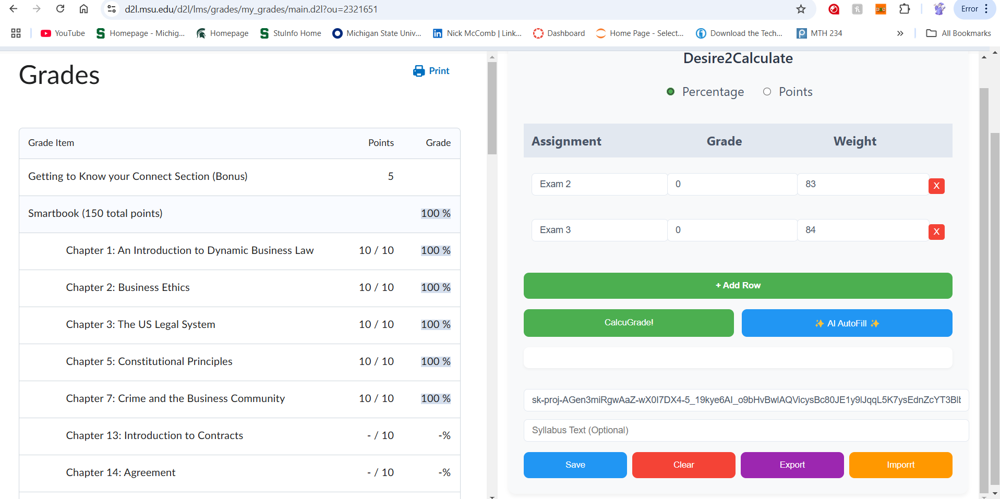

# D2L Grade Calculator Chrome Extension

## Overview

This Chrome extension enhances the D2L (Desire2Learn) learning management system by adding a **Final Grade Calculator** to the side of the webpage.

## Features

### 1. **Manual Grade Entry**
- **Assignment Name**: You can manually enter the name of each assignment or exam.
- **Grade**: Input the grade you received for each assignment.
- **Weight**: Specify the weight (percentage) of each assignment in the overall grade calculation.

### 2. **AI-Powered Auto Parsing**
- The extension offers an option to use **AI** to automatically parse the D2L webpage and fill in the assignment data.

### 3. **Switchable Grading Scale**
- The extension allows you to switch between **Percentage-Based Calculation** and **Points-Based Calculation**.
    - **Percentage-Based Calculation**: Assignments are weighted by percentage.
    - **Points-Based Calculation**: Enter the total points for each assignment and their respective weight in points.

## How It Works

### Manual Grade Input:
1. Once the extension is activated, a **Final Grade Calculator** will appear on the side of the D2L webpage.
2. Input the **Assignment Name**, **Grade**, and **Weight** for each assignment.
3. Click the **Calculate** button to see your final grade based on the provided data.

### AI Auto Parsing:
1. To use the AI-powered feature:
    1. Enter your **API Key** and **Syllabus topic**.
    2. Click the **Select Key** button to let the AI parse the syllabus and automatically fill the assignment fields.

### Switching Between Grading Scales:
1. The extension gives you the option to switch between two grading scales:
    - **Percentage-Based Calculation**: Assign weights as percentages of the total grade.
    - **Points-Based Calculation**: Input the total points for each assignment, and the extension will calculate your grade based on points rather than percentages.

## Screenshot

Here’s what the extension looks like when activated on a D2L webpage:

*Figure 1: The Final Grade Calculator on the side of the page with manual entry fields.*

## Troubleshooting

- **API Key Issues**: Ensure that your **API Key** is valid and entered correctly.
- **Missing Table**: If the extension doesn't find the table of grades, double-check that you are on the correct D2L page and that it contains the expected table structure.

---

## Contributing

If you'd like to contribute to the development of this extension, feel free to fork the repository and submit pull requests.

